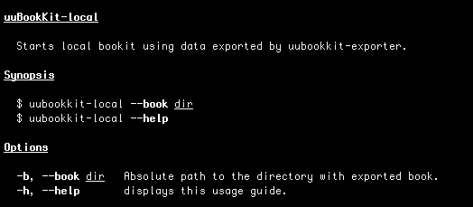

This tool starts local uuBookKit using JSON files exported by <https://www.npmjs.com/package/uubookkit-exporter>.

# How to install ?

`npm install --registry "https://repo.plus4u.net/repository/npm/" -g jdk_localbookkitg01_main-server`

# How to use ?

When server is started open <http://localhost:6221/jdk-localbookkitg01-main/0-0/> . The book structure with all pages should be visible in left menu. For each page you can view the content or switch to JSON source. 

# How to develop ?

Publish to npmjs: 

`npm publish --registry http://registry.npmjs.com`
